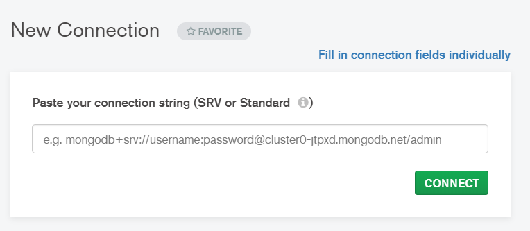
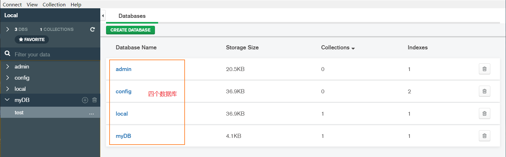

# mongoDB 笔记

## 下载与安装
来到官网，安装 mongoDB：[https://www.mongodb.com/download-center/community](https://www.mongodb.com/download-center/community)  

点击下载，安装时不需要配置操作（一般是换一下安装路径），安装路径要记得，因为安装完成后还要配置环境变量。  

安装完毕后，需要配置环境变量，来到 mongoDB 的安装位置，将 `bin` 目录的路径添加到 环境变量中。  

Windows10 下 右键点击 `此电脑` --> `属性` --> 左侧有一个 `高级系统设置` --> 下面就是 `环境变量...` --> 选择用户变量中的 `Path` --> 点击下方的 `编辑` --> 点击右侧的 `新建` --> 将 `bin` 路径粘贴上去 --> 依次点击 `确定`。   

这样就配置好了环境变量。然后验证变量是否能拿到，打开 `cmd`，输入 `mongo` 命令，如果命令运行成功，则说明无误。 

来到 C 盘，在C盘根目录下新建一个 `data` 目录，再在 `data` 目录中新建一个 `db` 目录和 `log` 目录。为了开启 mongodb 服务，开启服务后，以后的数据就会存储到 db 目录下。  

## 开启服务
- 打开 `cmd` ，输入 `mongod` 启动 `mongodb` 服务器。如果出现下面的回显，表明开启服务成功。  

[mongoDB 开启服务器](./img/mongod-server.png)  

- 不要关闭之前的 cmd 窗口，因为服务器正在监听，应再打开一个 cmd 窗口，运行 `mongo`，连接 mongodb。  

- 如果你不想在 C盘 中建立数据库，可以使用下面的命令设置 db 路径（运行后，db 在指定的路径下创建，port 表示服务的端口号，mongodb 默认是 27017 端口）。  

```cmd
mongod --dbpath d:\data\db --port 12345
```

- 打开浏览器，输入 `localhost:1234` 就可以访问到 mongodb 服务页面，显示的内容如下：  

```txt
It looks like you are trying to access MongoDB over HTTP on the native driver port.
```

数据库分为两部分：

1. 数据库的服务器
   - 服务器用来保存数据；
   - `mongod` 命令用来启动服务器；
  
2. 数据库的客户端
   - 客户端用来操作服务器，对数据进行增删改查的操作；
   - `mongo` 命令用来启动客户端；

因此，服务器不要关闭，不然客户端就不能访问到服务器。因此这样不太方便，每次要用 mongodb 还要使用 cmd 手动启动。解决办法是让 mongod 服务开机自启，这样就不用每次手动去启动了。如果安装的mongoDB 版本大于等于 `4.0`，可以不用看下面的步骤，因为MongoDB默认会自动开启服务。  

如果版本比较低，需要运行执行以下的步骤：    

- 在 Windows10 下，在 data 目录下创建 db 和 log 文件夹（你安装mongoDB时也会让你配置这两个路径，不需要创建也行）；
- 创建配置文件；
  - 在 mongodb 安装路径下的 `bin` 目录的同级目录中创建一个配置文件：`mongod.cfg`；
  - 然后把下面的代码拷贝到 `mongod.cfg` 文件中；  

```cfg
systemLog:
    destination: file
    path: c:\data\log\mongod.log
storage: 
    dbPath: c:\data\db
```

path 路径表示的是日志（`log`）路径，`dbPath` 表示的是数据库路径。  

然后使用管理员身份打开 cmd 命令窗口，输入以下的命令： 

```cmd
sc.exe create MongoDB binPath="\"c:Program Files\MongoDB\Server\bin\mongod.exe\" --service --config=\"c:Program Files\MongoDB\Server\mongod.cfg\"" DisplayName= "MongoDB" start= "auto"
```

`binPath` 就是 `bin` 目录下 `mongod.exe` 程序的路径，`--config` 后面的路径就是配置文件的路径。  

## mongoDB 数据库概念

1. 数据库（`database`）
   - 数据库是一个仓库，在仓库中可以存放集合；

2. 集合（`collection`）
   - 集合类似于数组，在集合中可以存放文档；

3. 文档（`document`）
   - 文档是数据中的最小的单位，我们存储和操作的内容就是文档；

在下载 `mongDB4.0` 以上的社区版后，还会默认下载一个 `MongoDB Compass Community` 软件，这是数据库可视化软件，双击打开这个软件后，点击 `CONNECT` 按钮就会进入一个页面。

  

就可以清楚的看到，本地数据库一共有四个数据库，`myDB` 数据库中还有一个名为 `test` 的集合。  

  

所以，**在数据库中放的是集合，集合中存放的的是文档**。  

在 mongodb 客户端操作上面提到的三个概念，即：运行 `mongo` 命令即可去操作数据可。  

以下是mongoDB的一些命令：

> 需要注意的一点是：在 mongodb 中，数据库和集合都不需要手动创建，当我们创建文档时，如果文档所在的集合或数据库不存在时，会自动创建数据库和集合。

|命令|描述|
|:---|:---|
`show dbs`|展示有多少数据库|
`use 数据库名`|进入到指定的数据库中，如果这个数据库本来没有，也可以进入，当第一次向这个数据库中创建文档时，这个数据库会被真实的创建出来|
`db`|显示当前所在的数据库|
`show collections`|展示数据库中所有的集合|  
`db.dropDatabase()`|删除数据库|
`db.集合名.drop()`|把所在的集合删除掉（清空集合中的所有文档）|

## 数据库的增删改查操作

### 1.增加操作
- `db.集合名.insert({...})` 向集合中添加一个文档（对象）；
- `db.集合名.insert([{...},{...},{...}])` 向集合中添加多个文档；
- `db.集合名.insertMany([{...},{...}])` 向集合中添加多个文档（必须以数组形式传入参数）；
- `db.集合名.insertOne({...})` 向集合中添加一个文档数据（只能是一个）；  

### 2. 查询操作
- `db.集合名.find()` 查找集合中所有的文档（也可以这么写：`db.集合名.find({})`）；
- `db.集合名.find({age: 10})` 查找文档中 `age == 10` 的文档数据；
- `db.集合名.find({age: 10,sex: "女"})` 查找文档中，`age == 10` 而且 `sex == “女”` 的数据；
- `db.集合名.findOne({...})` 查找文档中符合条件的第一条数据，因为 `find` 命令会返回所有满足条件的数据，而 `findOne` 只返回一条数据；
- `db.集合名.find({...}).count()` 返回查询得到的结果的数量；
- `db.集合名.find({age: 20},{name: 1})` 查询 `age == 20` 的数据，并且查询结果只显示字段（`_id` 也会显示），`1` 就表示显示，`0` 表示不显示该字段； 
   
  比如，有一个集合中的文档数据为：{name: "Joy",age: "20",sex: "male",_id: ObjectId("5e26730954074525adc48401")}，如果运行上面的命令，则返回的结果是 `{_id: ObjectId("5e26730954074525adc48401"),name: "Joy"}`。如果你不想显示 `_id` 则可以设置为：`{name: 1,_id: 0}`。  

#### find 高级查询
高级查询需要用到查询操作符，如下表（实例中，直接写了 `find()`，在实际中，应该是 `db.集合名.find()`）：  

|查询函数|说明|实例|描述|
|:---|:---|:---|:---|
`$gt`|表示“大于”|`find({age: {$gt: 20}})`|寻找 `age > 20` 的数据|
`$lt`|表示“小于”|`find({age: {$lt: 20}})`|寻找 `age < 20` 的数据|
`$gte`|表示“大于等于”|`find({age: {$gte: 20}})`|寻找 `age >= 20` 的数据|
`$lte`|表示“小于等于”|略...|略...|
`$ne`|表示“不等于”|`find({age: {$ne: 20}})`|寻找 `age != 20` 的数据|
`$in`|表示满足给定数组中的一个时就返回|`find({age: {$in: [20,30,40]}})`|当 age 等于数组中的任意一个值时就返回匹配到的结果|
`$nin`|与 `$in` 功能相反，值不是数组中的项时才匹配|略...|略...|
`$or`|“或”的意思，多个条件满足一个就行|`find({$or: [{age: 18},{sex: "female"}]})`| 表示查找 `age == 18` 的数据，或者 `sex == "female"` 的数据（两个条件没有关联）|

  

下面介绍一些不太好理解的查询操作符。  

1. `$exists`  
   它的值直接收 `true` 或 `false`。true 返回存在查询字段的数据，false 表示返回不存在查询字段的数据；比如我们的文档数据都有 `name` 字段，如果使用 `find({name: {$exists: true}})`，因为都有 name 字段，则会返回文档的所有内容，而 `find({name: {$exists: false}})` 时，因为 name 字段都有，false 表示返回不存在 name 字段的数据，因此返回为空，表示没有这样的数据。  

2. `$size`  
   它的值是一个数字，而要查询的字段应该是一个数组，`$size: n` 表示数组长度等于 n 的数据都返回。比如，works 字段是被查询字段，而且是个数组，于是就可以使用 `find({works: {$size: 3}})`，表示 works 的值（数组）长度等于3 时才返回。  

3. `$mod`  
   取模运算。比如：`find(age: {$mod: [10,1]})` 表示要查找 `age % 10 == 1` 的数据；  

4. **模糊查询**  
   格式：`find({"键名": 值})`。`值` 需要是一个 **正则表达式**，与 JS 的正则格式一样。比如 `find({name: /^刘/})` 表示查找姓刘名字的人；


查询可以嵌套，比如下面的语句：  

```js
// 查找 age >= 18 的人，或者 name 以“张”开头的人
find({
    $or: [
        {
            age: {$gte: 18}
        },{
            name: /^张/
        }
    ]
});
```  

### 3. 更新操作
格式：`db.集合名.update(查询条件,修改后的内容)`。  

查询条件与上面的 `find` 方法一样；修改后的内容就是你想把查到的结果更改成什么样子，比如我要查找 name = "Joy" 的数据，然后将其中的 age 字段改成 `28`，于是可以这么做：`db.集合名.update({name: "Joy"},{age: 28})`。运行之后，发现原来的字段都没了！只有 `_id` 和 `age: 28` 两个字段了，这是因为 `update` 默认是做“覆盖操作”。想要只更新你想更新的数据，可以使用 `$set` 操作符。  

```cmd
db.集合名.update(
    {name: "Joy"},
    {$set: {age: 28}}
);
```

与 `$set` 对应的还有一个 `$unset` 运算符，表示 **删除指定的字段**。如果运行 `update({name: "Joy"},{$unset: {age: 1}})`，就会把 `name = "Joy"` 的数据中的 `age` 字段删除（`age: 1`，中的 `1` 无所谓的，指定是几都行，因为这个属性都要被删除了，值已经没用了）。

`update` 函数默认情况下只会修改一个文档数据，如果你想把查找到的数据都做修改，可以使用 `updateMany()` 函数。或者在 `update` 函数中的第三个参数传入一个对象，该对象是一个配置对象，里面有一个 `multi` 属性，当值等于 `true` 时表示要修改所有匹配到的数据。  

```js
// 将所有的 male 都改成 “男”
db.集合名.update(
    {sex: "male"},
    {$set: {sex: "男"}},
    {multi: true}
);
```

除此之外，还有一个 `updateOne()` 函数，它表示只修改一个数据。  

### 4. 删除操作
格式：`db.集合名.deleteOne(查询条件)`。他会把满足查询条件的数据删除掉。
删除操作也有三个函数：  

- `db.集合名.deleteOne(查询条件)` 删除第一个满足条件数据；
- `db.集合名.deleteMany(查询条件)` 删除所有满足条件的数据；
- `db.集合名.remove()` 可以删除多个，也可以删除一个（默认是删除多个）；  

这里说一下 `remove` 的用法。remove 第一个参数是查询条件，第二个参数是可选参数，是个布尔值，当是 `true` 时表示只会删除一条数据；`false` 表示删除多条数据（默认）。  

如果你想清空一个集合中的所有文档，可以这么干（但最好不要做）：`db.集合名.remove({})`。  

使用 `remove({})` 方式清空集合中的文档效率并不高，因此不如使用 `db.集合名.drop()`。

## 排序与映射


