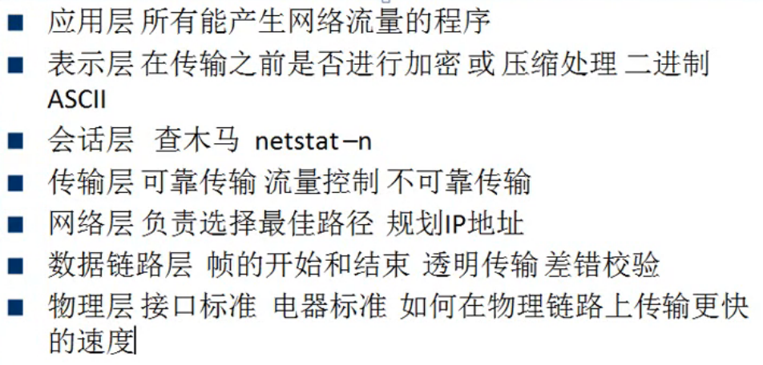

# 计算机网络

## OSI 七层模型

  

## 计算机网络的性能
### 1. 速率
速率是连接在计算机网络上的主机在数字信道上传送数据位数的速率，也称 `data rate` 或 `bit rate`。  

单位是 `b/s`、`kb/s`、`Mb/s`、`Gb/s`。  

> 1b 就是 1 比特（byte），1比特等于8个字节（bit）  

### 2. 带宽
数据通信领域中数字信道所能传送的最高数据率。单位也是 `b/s`、`kb/s`、`Mb/s`、`Gb/s`。  

### 3. 吞吐量
单位时间内通过某个网络的数据量。单位也是 `b/s`、`kb/s`、`Mb/s`、`Gb/s`。  

### 4. 时延
时延有四个：发送时延、传播时延、处理时延、排队时延。  

- 发送时延 = 数据块长度（比特）/ 信道带宽（比特/秒）  
- 时延带宽积 = 传播时延 * 带宽  

### 5. 往返时间
从发送方发送数据开始，到发送方收到接收方确认。可以使用 `ping` 命令还测试往返时间。

### 6. 网络利用率
- 信道利用率 = 有数据通过时间 / （有 + 无）数据通过的时间  
- 网络利用率 = 信道利用率加权平均值  

D = D0 / (1 - U)。其中：`D0` 表示网络空闲时的延时；`D`表示网络当前的时延；`U` 表示信道利用率。  

## 物理层
物理层解决的是如何在各种计算机的传输媒体上传输数据比特流，而不是指具体的传输媒介。物理层的主要任务是：确定传输媒体的接口的一些特性。  

### 网线
1. 直通线：应用最广泛，双绞线的夹线顺序两边一致，这种类型的以太网电缆用来实现以下连接：  
   - 主机到交换机或集线器
   - 路由器到交换机或集线器  
2. 交叉线（绞线的夹线顺序两边不一致，通常两种相同设备使用交叉线）  
   - 交换机到交换机
   - 集线器到集线器
   - 主机到主机
   - 集线器到交换机
   - 路由器直连到主机  

