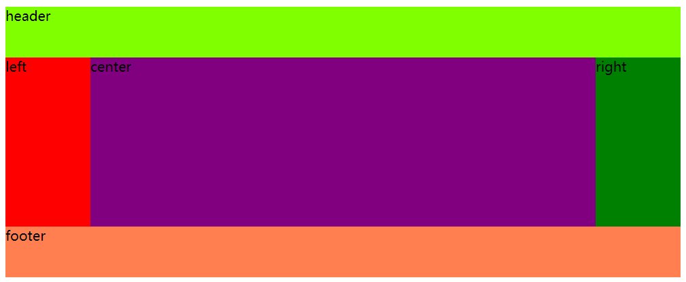
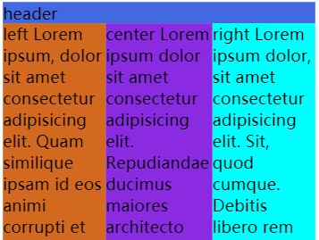

# CSS 笔试题

## 1. 超链接注册伪类

`:link`、`:visited`、`:active` 和 `:hover` 的声明顺序是怎样的？  

`:link` 表示未访问的链接状态；  
`:visited` 表示已访问状态；
`:active` 表示激活状态（鼠标按下）；
`:hover` 表示悬停状态。  

推荐顺序是 `LVHA`，即 `:link` `:visited` `:hover` `:active`。理由如下：  

- 当鼠标悬停在未访问的链接上时，`:link` 和 `:hover` 都会命中，如果 `:hover` 在 `:link` 之前声明，那么(`:hover`)就会被覆盖；
- 当鼠标悬停在已访问的连接上时，`:visited` 和 `:hover` 都会命中，如果 `:hover` 在 `:visited` 之前声明，那么(`:hover`)就会被覆盖；
- 当鼠标单击链接时，`:active` 和 `:hover` 都会命中，我们大多是想让 `:hover` 只在悬停时展示样式，按下鼠标时使用 `:active` 样式，因此 `:active` 在 `:hover` 之后声明；
- 综上，`:hover` 应在 `:link` 和 `:visited` 之后，在 `:active` 之前，因此 `active` 在最后。而 `:link` 和 `:visited` 两者的顺序无所谓，互不影响。  

## 2. 三栏布局

在网页布局中，三栏布局是一种常见的布局方式，尤其在 PC 端。如下图所示。

  

从上到下由页头、内容和页脚组成，内容由左、中、右三列组成，其中左右两列的宽度固定，中间一列自适应。假设左右宽度是 100px，header 和 footer 的高度是 60px。

下面介绍五种方式，分别是：浮动、绝对定位、`flex-box` 和 `grid-box` 和表格布局。  

HTML 骨架如下：  

```html
<main>
    <header>header</header>
    <article>
        <section class="left">left</section>
        <section class="center">center</section>
        <section class="right">right</section>
    </article>
    <footer>footer</footer>
</main>
```

### 浮动布局

使用浮动需要把 HTML 骨架调整一下，将三个 `section` 的顺序调整为：  

```html
<!-- center 移到第一个 -->
<section class="center">center</section>
<section class="left">left</section>
<section class="right">right</section>
```

代码如下：  

```css
header{
    height: 60px;
}
footer{
    height: 60px;
    /* article 中的元素使用了浮动，这里清除一下 */
    clear: both;
}

article{
    /* 值是三个是，分别表示 上、左右、下 */
    /* 左右的 padding 值应与 left、right 区域宽度一致 */
    padding: 0 100px 0;
}

article section{
    float: left;
}

.center{
    /* 让中间的容器宽度等于父容器的宽度 */
    /* 父容器还有 padding，因此父容器两侧会有 100px 的空白区域 */
    width: 100%;
}
.left{
    width: 100px;
    /* margin 的值是百分比时，是相对于父容器的宽度 */
    /* -100% 会向左移动父容器的宽度那么长 */
    margin-left: -100%;
    /* 使用相对定位 */
    position: relative;
    right: 100px;
}

.right{
    width: 100px;
    margin-right: -100px;
}
```

这种实现被称为“圣杯布局”。除了上面的方式之外，使用浮动 + `calc` 也可以做到中间部分自适应。HTML 骨架也不需要做调整。代码如下：  

```css
header{
    height: 60px;
}
footer{
    height: 60px;
    clear: both;
}

article section{
    float: left;
}

.left {
    width: 100px;
}
.right {
    width: 100px;
}
.center{
    /* 宽度是一个计算值，用父容器宽度，减去左右容器的宽度 */
    width: calc(100% - 200px);
}
```

还有一种常见的使用浮动实现的三栏布局，被称为“双飞翼布局”。它的 HTML 结构如下：

```html
<main>
    <header>header</header>
    <article class="container column">
        <section class="center">center</section>
    </article>
    <article class="left column">left</article>
    <article class="right column">right</article>
    <footer>footer</footer>
</main>
```

CSS 代码如下：

```css
.container{
    width: 100%;
}

.column{
    float: left;
}

.center{
    margin: 0 100px 0;
}
.left{
    width: 100px;
    margin-left: -100%;
}
.right{
    width: 100px;
    margin-left: -100px;
}
footer{
    clear: both;
}
```

双飞翼布局与圣杯布局相似，不同的是双飞翼布局没有使用相对定位。

### 绝对定位

代码如下：  

```css
header{
    height: 60px;
}
footer{
    height: 60px;
}

article{
    position: relative;
}

article section{
    position: absolute;
    height: 200px;
}

.left {
    width: 100px;
}
.right {
    right: 0;
    width: 100px;
}
.center{
    /* 左右都设置值，可以让中间容器自适应 */
    left: 100px;
    right: 100px;
}
```

绝对定位不好的一点是，因为元素脱离了文档流，导致 `footer` 元素会“往上跑”，与定位元素重叠。要让 `footer` 跑到下面，需要做额外的样式处理，比如设置 margin-top、给 `footer` 也设置上绝对定位。如果三个容器的高度不一致，或者容器内的内容溢出，就会影响布局美观性。不推荐使用这种方式实现圣杯布局。

### 弹性盒子

使用弹性盒子很容易创建出圣杯布局。代码如下：  

```css
article{
    display: flex;
}
.left, .right{
    /* 这里的宽度也可以使用 flex 中的 flex-basis 属性 */
    /* flex-basis 表示 flex 元素在主轴方向上的初始大小 */
    /* flex-basis: 100px */
    width: 100px;
}
.center{
    flex-grow: 1;
}
```

`flex-grow` 是重点，它指定 flex 容器中剩余空间的多少应该分配给项目。因为左右容器的宽度都已经确定，如果指定是 1，表示剩余空间都分配给 `.center` 容器。如果是 `.5` 则表示分配一半空间给中间的容器。  

### 网格布局

网格布局是新出的一种布局方式。首先改造一下 HTML 骨架。代码如下：  

```html
<main>
    <header>header</header>
    <section class="left">left</section>
    <section class="center">center</section>
    <section class="right">right</section>
    <footer>footer</footer>
</main>
```

然后是 CSS 代码：

```css
main{
    display: grid;
    grid-template-columns: 100px 1fr 100px;
}

header, footer{
    height: 60px;
    grid-column: 1/-1;
}
```
网格布局比较难理解，属性众多，但可以轻松布局出复杂的页面。解释一下上面的 css 代码。在 grid-template-columns 属性中设置了三列的页面布局。行数是自适应的。三列的左右两端都是 100px，中间是自适应，`1fr` 在这里会分配剩余的空间。  

接着设置 `header` 和 `footer`，重新设置它们占用的列数，`1/-1` 表示占满一行（自己独占一列）。  

在不改变 HTML 骨架的情况下使用 grid 布局，只需要设置 `article` 容器为网格布局即可。代码如下：  

```css
article{
    display: grid;
    grid-template-columns: 100px 1fr 100px;
}
```
两行代码就可以做到圣杯布局，足见网格布局的强大。  

### 表格布局

使用表格布局也可以做到中间容器自适应，代码如下：  

```css
article{
    display: table;
    width: 100%;
}
article section{
    /* 子元素是单元格 */
    display: table-cell;
}
.left{
    width: 100px;
}
.right{
    width: 100px;
}
```

以上几种方式都可以做到中间容器自适应，但也有一个问题，如果浏览器窗口很小，中间容器的宽度会很短。  



解决这个问题可以在 `body` 元素上设置一个最小宽度，当窗口宽度比这个宽度还要小时，就不再自适应。  

```css
body{
    min-width: 600px;
}
```

## 3. 透明与隐藏

1. background: transparent; 与 opacity: 0; 的区别是什么？  

答：background: transparent; 仅仅是将元素的背景设置成透明；而 opacity: 0; 会把元素和内容（包括其子元素）都变成透明。  

2. display: none; 与 visibility: hidden; 的区别是什么？  

答：visibility: hidden; 会隐藏元素，但是其他元素的布局不改变，相当于此元素变成透明，它会导致浏览器重绘。如果子元素设置了 visibility: visible; 那么子元素依然可见，；display: none; 相当于元素没有了后代元素，在正常流中不占用任何空间，元素的真是尺寸将会丢失，还会导致浏览器的重排（Reflow）和重绘（Repain）。  

## 4. vmin 与 vmax

假设视口的宽是 50px，高是 70px，执行下面的代码后，div 元素的宽经过计算后为__px？高是__px？   

```css
div{
    width: 10vmax;
    height: 10vmin;
}
```

> 答案：宽是 7px；高是 5px。

如果将视口的宽和高均分成 100 份，那么 `vmax` 会取较大的百分之一，而 `vmin` 会取较小的百分之一。对于上面题目来说，`10vmax` 就是 `7px`，而 `10vmin` 就是 `5px`，因为视口的高度比宽度大，`vmax` 会通过视口的高度计算（使用较大的尺寸），`vmin` 会通过视口的宽度计算（使用较小的尺寸）。  

## 5. 

