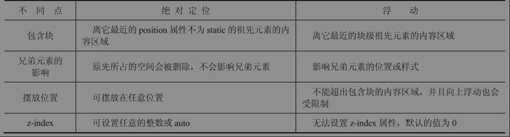

# HTML 相关

## 1. href 与 src 的不同

两者的功能不同。`href`（hypertext reference）能够建立一条通道，将当前文档和定义的资源连接起来。src（source）是将定义的资源嵌入到当前文档中。  

## 2. 绝对定位与浮动

绝对定位和浮动都会脱离正常流，改变元素盒类型，将元素变为块级元素，同时都能创建 BFC。不同之处如下表：  

  

## 3. 溢出剪裁

下面代码 `.wrapper` 的子元素哪些会被剪裁？  

```html
<style>
    .wrapper{
        position: relative;
        height: 100px;
        width: 100px;
        overflow: hidden;
    }
    .abs{
        /* 绝对定位 */
        position: absolute;
        left: 120px;
        top: 10px;
        height: 50px;
        width: 50px;
    }
    .fixed{
        /* 固定定位 */
        position: fixed;
        left: 10px;
        top: 120px;
        height: 50px;
        width: 50px;
    }
    .child{
        /* 高度超出 */
        height: 120px;
        width: 50px;
    }
</style>
<div class="wrapper">
    <div class="abs"></div>
    <div class="fixed"></div>
    <div class="child"></div>
</div>
```

`.abs` 元素和 `.child` 元素会被剪裁，`fixed` 不会被剪裁。