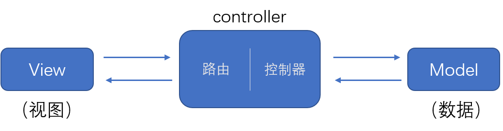
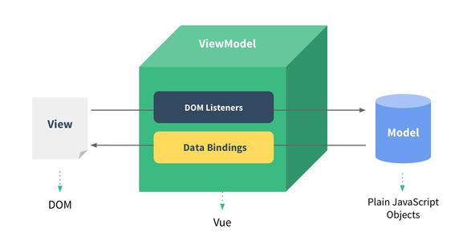
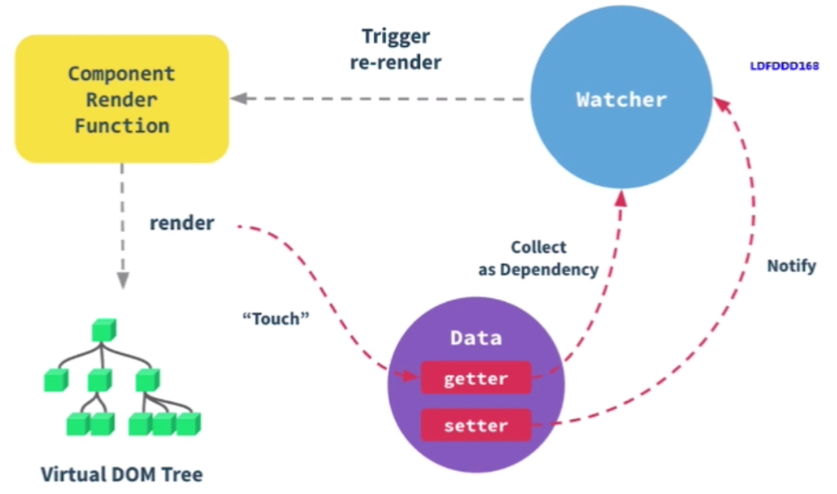
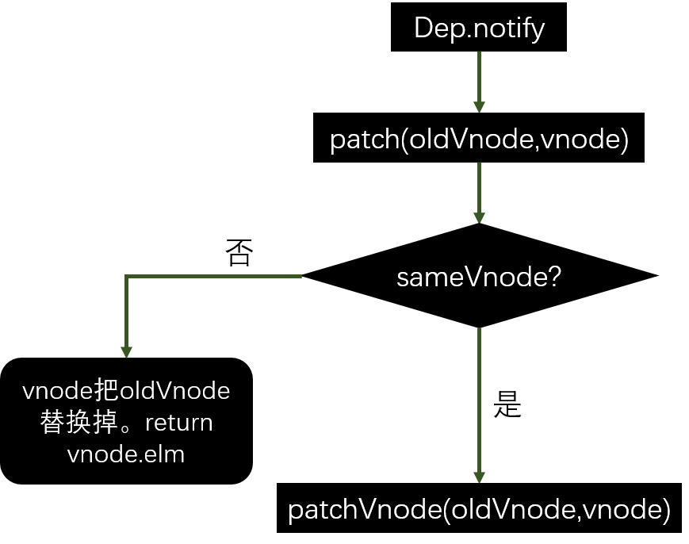
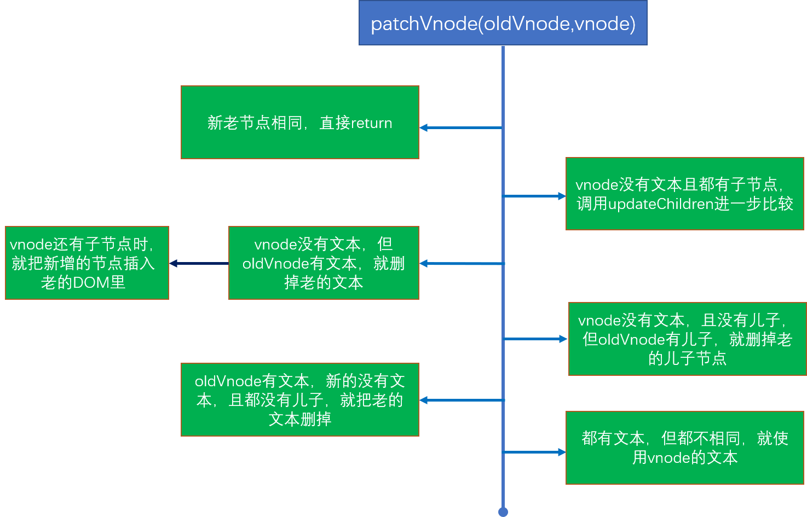
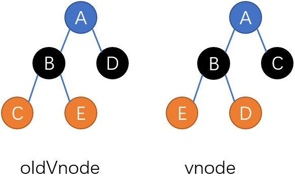
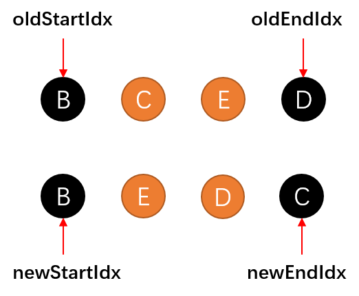
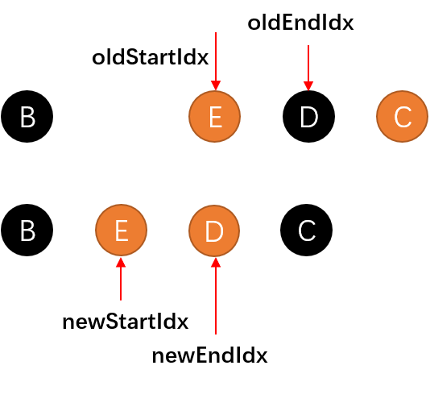
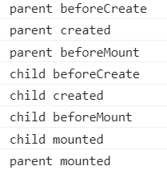
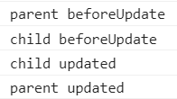

# 深入 Vue

Vue 原理主要包括三大部分：响应式、模板编译和虚拟 DOM。

## 1. 响应式原理

### MVVM 模型
`MVVM` 是 Model-View-ViewModel 的简写。MVVM 用数据驱动视图。传统组件（如 asp、jsp、php）只是静态渲染，更新时还要依赖于操作 DOM。传统组件遵循 MVC 模型，即模型（Model）-视图（View）-控制器（Controller）。MVC 模式下，后端使用数据（Model部分）填充 HTML 模板，前端（View部分）访问不同的路由时展示不同的视图，这些视图都是后端已经渲染好的 HTML 文档。

  

而 `MVVM` 不再直接操作 DOM，而是操作数据，数据的变化会引起页面的变化。MVVM 更专注于数据（业务逻辑）。在前端页面中，把 Model 用纯 JavaScript 对象表示，View 负责显示，两者做到了最大限度的分离。把 Model 和 View 关联起来的就是 ViewModel。View Model 负责把 Model 的数据同步到 View 显示出来，还负责把 View 的修改同步回 Model。  

  

在 Vue 中，View 部分相当于我们书写的 JSX；而 Model 部分相当于 Vue 当中的 `data`；`View Model` 在 Vue 中体现在事件（methods）、计算（computed）等部分。  

### 监听数据变化

在 Vue 中，数据的变化会引起视图的更新。如何监听数据的变化？  

Vue 在初始化数据时会给 data 中的属性使用 Object.defineProperty 方法重新定义属性，把属性转化成 getter/setter。例如：  

```js
function updateView(){
    // 这个函数就相当于页面更新的函数
    console.log('页面更新！');
}

function observer(target){
    if(typeof target !== 'object' || target === null) {
        return target;      // 不是对象就直接返回，这也是该函数递归的出口
    }
    for(let key in target){     // 如果传入的是一个对象
        defineReactive(target, key, target[key]);
    }
}

function defineReactive(target, key, value){
    observer(value);    // value 也可能是一个对象，这时就要递归遍历
    Object.defineProperty(target, key, {
        get(){
            return value;
        },
        set(newVal){
            // 当值改变后都会调用 updateView 函数
            if(newVal !== value){
                // 改变后的新值可能是一个对象，就要递归遍历这个对象
                // 让这个对象的所有属性都是可监听的
                observer(newVal);
                value = newVal;
                updateView();
            }
        }
    });
}
```

测试如下：  

```js
var obj = {
    count: 1,
    person: {
        name: 'Ming'
    }
}

observer(obj);
obj.count = 2;  // 页面更新！
obj.person.name = 'Li'; // 页面更新！
```

需要注意的是，对监听的对象新增或者删除属性，是监听不到的，updateView 不会执行，例如：

```js
obj.x = 123;
delete obj.count;
```

深度监听使用了递归，计算量很大。为了优化这些缺陷，Vue3.0 使用 `Proxy` 取代了 defineProperty 方法来实现数据监听。  

### 如何监听数组？  

上面的代码中使用 defineProperty 实现了对象数据的监听，在 Vue 中监听数组变化是扩展数组原型的方式实现的。在数组中，`push`、`pop`、`shift`、`unshift`、`splice`、`reverse` 等方法会改变原数组。这些方法在改变原数组后需要触发更新，就可以这样实现：  

```js
const oldAryProperty = Array.prototype;
// 这样做不会影响原数组的原型上的方法。
// aryProto.__proto__ === oldAryProperty
const aryProto = Object.create(oldAryProperty);

['pop','push','shift','unshift','splice','reverse'].forEach(method => {
    aryProto[method] = function(){
        updateView();
        oldAryProperty[method].call(this, ...arguments);
    }
});

function observer(target){
    if(Array.isArray(target)){
        // 是数组时，就改变数组实例的原型
        // 调用数组方法时，就会首先查找 aryProto 中的方法
        // 找不到时才到 原数组的原型上查找
        target.__proto__ = aryProto;
        return target;
    }
    // ...
}
```

### Vue3 中的响应式

`defineProperty` 有缺陷，深度监听时是一次性把对象递归遍历完成，如果 data 层级太深，递归计算次数会多，消耗时间。Vue3 使用 ES6 中的 `Proxy` 代替了 `defineProperty` 来实现响应式。  

Vue3.0 中可以使用 `reactive` 函数将一个普通对象包装成可监听的数据。它的大致代码如下：  

```js
const isObject = (target) => typeof target === 'object' && target !== null;
const hasOwn = (target, key) => Object.prototype.hasOwnProperty.call(target, key);

function get(target, key, receiver) {
    // result 是取到的值
    const result = Reflect.get(target, key, receiver);
    console.log('对这个对象取值', target, key);
    // 如果获取的值还是一个对象，那就也进行监听
    if (isObject(result)) {
        return reactive(result);
    }
    return result;
}

function set(target, key, value, receiver) {
    // receiver 是 proxy 实例本身
    // hadKey 用于判断 key 是不是 target 上的属性
    const hadKey = hasOwn(target, key);
    const oldValue = target[key];
    // 设置新的值
    const result = Reflect.set(target, key, value, receiver);
    if (!hadKey) {
        console.log('新增操作', target, key);
    } else if (value !== oldValue) {
        // 修改操作，老值与新值不相等时，才更新
        console.log('更新操作', target, key);
    }
    // 之没有变化，就什么都不操作
    return result;
}

function deleteProperty(target, key) {
    const result = Reflect.deleteProperty(target, key);
    console.log('delete property', key);
    return result;
}

function reactive(target) {
    // 创建一个响应式对象，目标对象可能不一定是数组或对象，可能还有 set map
    return createReactiveObject(target, {
        get,
        set,
        deleteProperty
    });
}

function createReactiveObject(target, baseHeadler) {
    if (!isObject(target)) { // 不是对象直接返回即可
        return target;
    }
    const observed = new Proxy(target, baseHeadler);
    return observed;
}
```

使用 `Proxy` 不仅在更新时可以监听到数据变化，在删除和新增时也能监听到，而 `defineProperty` 是不行的。而且 `Proxy` 不是一次性递归遍历对象，而是在取值时才做递归。使用 Proxy 实现数据的监听更加优雅。在上面代码中，还使用了 `Reflect`，被称为“反射”，它也是 ES6 中的 API，它与 `Proxy` 的能力一一对应。`Reflect` 的出现使得 JavaScript 这门语音更加规范化和函数式，它内部定义了许多可以代替 Object 上的工具函数的方法。关于 `Proxy` 和 `Reflect` 的更多用法可以参考 MDN：  

[Proxy](https://developer.mozilla.org/zh-CN/docs/Web/JavaScript/Reference/Global_Objects/Proxy)  
[Reflect](https://developer.mozilla.org/zh-CN/docs/Web/JavaScript/Reference/Global_Objects/Reflect)  

`Proxy` 很好用，但是好的东西总是兼容性不太行。`IE` 浏览器是不支持的，而且这个 API 不能 polyfill。

### computed 和 watch
在 Vue 中，初始化数据时，会给 data 中的属性使用 Object.defineProperty 重新定义所有属性，这个方法可以让数据的获取或设置都增加一个拦截的功能，我们可以在获取（getter）或者更新（setter）的时候增加一些逻辑，这些逻辑称为“依赖收集”。当数据变化时，可以通知收集的依赖去更新，而这些收集的东西被称为 `watcher`。比如在页面初始渲染的时候，会对数据取值，取值的时候，会收集一些依赖（watcher），把这些依赖先存起来，当数据变化时通知对应的 watcher 去更新视图（Vue 中调用 `notify` 函数通知）。 在 Vue 中，可以使用 `computed` 和 `watch` 属性添加依赖收集逻辑，这两个属性都可以观察和响应 Vue 实例上的数据变动。相比于 `computed`，`watch` 更有通用性，它可以在数据变化时执行异步或开销较大的操作。如果监听的数据是对象，`watch` 中可以传入 `deep: true` 配置项，表示深度监听。相比于 `computed`，`watch` 不具备缓存能力。`computed` 在数据没有发生变化时不会重新计算。   

```js
watch: {
    'obj': {
        // 当数据变化时就会调用 handler 函数
        handler(val, oldVal){
            // ...
        },
        deep: true
    }
}
```

## 2. 异步渲染  

如果不采用异步更新，那么每次更新数据都会对当前组件进行重新渲染，为了性能考虑，Vue 会在本轮数据更新后，再异步去更新视图。Vue 内部会汇总 data 的修改，然后一次性更新视图，这样做是为了减少 DOM 操作次数，提高性能。通过 Vue 中的 `$nextTick` 函数也可以看出是异步更新。在数据更新后，如果我们要拿到更新后的 DOM 状态，应该使用 `$nextTick` 函数，比如使用数据把 li 列表增加了，想要获取到增加后的 li 元素数目，可以这么做：  

```js
methods: {
    add (item) {
        this.list.push(item);
        this.$nextTick(() => {
            console.log(this.$refs.ul.children.length);
        });
    }
}
```

在 Vue 中，使用 vue-template-complier 这个模块可以将模板（template）编译成 render 函数，执行 render 函数会生成虚拟 DOM。模板并不是 HTML，它有指令、插值、JS 表达式，还可以使用判断和循环，而 HTML 是标签语言，只有 JS 才能实现判断、循环。因此，模板一定是转换成了某种 JS 代码，通过对模板编译，生成原生的 JavaScript 代码。  

比如下面的例子，使用 vue-template-complier 这个模块将模板代码编译成 JS 代码：  

```js
const complier = require('vue-template-compiler');
const template = "<div id='main' v-if='isShow'><button class='btn' @click='handle'>Click</button></div>";
const res = complier.compile(template);     // 编译模板
console.log(res.render);        // 获取 render 属性
```

`res.render` 会打印出：  

```js
with(this){return (isShow)?_c('div',{attrs:{"id":"main"}},[_c('button',{staticClass:"btn",on:{"click":handle}},[_v("Click")])]):_e()}
```

`with` 是 JavaScript 中一个不建议使用的语句。它可以传入一个对象，在 with 语句内部，获取变量其实是在获取传入对象的属性。  

```js
var obj = {
    a: 1,
    b: 2
};

with(obj){
    console.log(a); // 获取的是 obj.a，1
    console.log(b); // 2
    console.log(c); // with 中获取不存在的属性或报错！
}
```

可见 `res.render` 内部的变量其实都是 Vue 实例上的属性。`_c` 函数即 createElement，创建 DOM 元素，`_v` 则相当于 createTextNode。模板被编译成了由 JavaScript 描述的 DOM 结构。在 Vue 中，除了使用 template JSX 写法之外，也可以这样定义 template：  

```js
{
    render: function(createElement){
        return createElement(
            'div',{
                staticClass: 'container'
            },
            [
                createElement('h2'),
                this.msg
            ]
        );
    }
}
```

上面代码就相当于：  

```jsx
<div class="container">
    <h2>{{ msg }}</h2>
</div>
```

### 编译 v-model  

```js
const complier = require('vue-template-compiler');
const template = `<div id='main'><input v-model='name' /></div>`;
const res = complier.compile(template);
console.log(res.render);
```

编译后的代码如下：  

```js
with(this){return _c('div',{attrs:{"id":"main"}},[_c('input',{directives:[{name:"model",rawName:"v-model",value:(name),expression:"name"}],domProps:{"value":(name)},on:{"input":function($event){if($event.target.composing)return;name=$event.target.value}}})])}
```

可以发现，v-model 默认通过绑定 `input` 事件更新 name 数据。

Vue 内部使用了大量的正则表达式和字符串拼接，将 template 编译成上面的代码形式。

模板编译成 render 函数，当执行 render 函数后会返回虚拟 DOM，基于虚拟 DOM 再执行 patch 和 diff。使用 webpack vue-loader，会在开发环境下编译模板（vue-cli 也是使用 webpack 构建），而不是在运行时编译，这样可以提高编译速度。这在启动本地服务时也能看出来，首次编译会比较慢，而之后修改代码更新页面会发现很快。

### 渲染过程

- 初次渲染  
  1. 解析模板为 render 函数（或在开发环境下已完成）；  
  2. 触发响应式，监听 data 属性的 getter、setter（初次渲染时一般是触发 getter 执行）；
  3. 执行 render 函数，生成虚拟 DOM（vnode），调用 patch(elem, vnode); 将 vnode 挂载到 elem 上。  

- 更新过程  
  1. 当修改数据时，会触发 setter；  
  2. 重新执行 render 函数，生成 newVnode（新的虚拟 DOM）；  
  3. 执行 patch(vnode, newNode)，新旧 vnoode 对比（diff 算法），更新视图。  

渲染过程如下图所示：  

  

图中，拦截属性的获取会进行依赖收集（Collect as Dependency）；拦截属性的更新操作，对相关依赖进行通知（Notify）。

## 3. V-DOM 与 Diff 算法

虚拟 DOM 出现的背景：在 jQuery 时代，可以自行控制 DOM 操作的时机，手动调整，但是当项目很大时，操作 DOM 的复杂度就会上来，DOM 操作会很耗费性能，操作 DOM 就还需要考虑优化 DOM 操作，提升性能。《高性能JavaScript》这本书中说，把 DOM 和 JavaScript 各自想象成一个岛屿，它们之间用收费桥梁连接。操作 DOM 后需要经过跨流程通信和渲染线程触发的重新渲染（重绘或者重排），在开发中，应尽量减少操作 DOM。而虚拟 DOM 出现后，更新 DOM 交给框架处理。操作虚拟 DOM 可能并没有操作真实 DOM 快，但是它让开发人员不再把很多精力放在操作 DOM 上，而是专注于处理业务数据。

虚拟 DOM 是用 JavaScript 模拟 DOM 结构，通过计算出最小的变更，操作 DOM 结构，更新视图。而 Diff 算法是虚拟 DOM 最核心、最关键的部分，好的 Diff 算法可以正确、快速的更新 DOM。DOM diff 算法时间复杂度为 `O(n)`。它的大概逻辑如下：  

- 只比较同一层级，不跨级比较；
- tag 不同（标签类型）则直接删掉重建，不再深度比较；
- tag 和 key 两者都相同则认为是相同的节点，不再深度比较。

JavaScript 可以使用对象描述 DOM 结构，例如：  

```js
{
    tag: 'div',
    props: {
        className: 'container',
    },
    children: [{
        tag: 'p',
        children: 'hello!'
    }]
}
```

上面的对象映射出 DOM 结构就是：  

```html
<div class="container">
    <p>hello!</p>
</div>
```

在 Vue 源码中，有一个 `sameVnode` 函数，它用来判断新老节点是不是同一个节点，代码大致如下：  

```js

function sameVnode (a, b) {
  return (
    a.key === b.key && (
      (
        a.tag === b.tag &&
        a.isComment === b.isComment &&
        isDef(a.data) === isDef(b.data) &&
        sameInputType(a, b)
      )
    )
  )
}
```

a 是 `oldVnode` 即老的虚拟 DOM，b 是新的虚拟 DOM，从代码中大致可以了解到，a 和 b 的判断条件有：  

- `key` 我们添加的 `key`，它们要相等；
- `tag` 标签名要一致；
- `isComment` 表示不是不是注释节点；
- `isDef` 这个函数用来判断传入的数据是不是有值（即数据不等于 undefined 和 null 是返回 true）；
- `sameInputType` 如果节点是 input 元素时，判断 type 是否相同；  

接下来是 `path` 函数，当数据发生变化时，set 方法会调用 `dep.notify` 通知所有订阅者 `Watcher`，订阅者就会调用 `path` 函数，给真实 DOM 打补丁，更新视图。  

大致代码如下：  

```js
function patch (oldVnode, vnode, hydrating) {
    if (isUndef(vnode)) {   // 如果新的虚拟节点是 undefined 或 null，并且老虚拟节点有值
        // 说明我们删除了节点，就调用 Destroy 生命周期钩子
        if (isDef(oldVnode)) invokeDestroyHook(oldVnode)
        return;
    }

    let isInitialPatch = false
    const insertedVnodeQueue = []

    if (isUndef(oldVnode)) {    // 如果老节点没有值
        // 这说明是首次调用 path，这是初次渲染
        // 初次渲染就直接把 vnode 挂载到 DOM 元素上
        isInitialPatch = true
        createElm(vnode, insertedVnodeQueue)
    } else {
        // 判断老虚拟节点是不是真实 DOM
        const isRealElement = isDef(oldVnode.nodeType)
        // 如果不是真实 DOM 并且 vnode 相同，就调用 pathVnode 进一步处理
        if (!isRealElement && sameVnode(oldVnode, vnode)) {
            // patch existing root node
            patchVnode(oldVnode, vnode, insertedVnodeQueue, null, null)
        }else{      // 不相等就直接删掉 oldVnode，重新创建
            const oldElm = oldVnode.elm     // oldVnode 对应的真实元素
            const parentElm = nodeOps.parentNode(oldElm);   // 拿到父元素
            createElm(vnode, insertedVnodeQueue);
            if(parentElm !== null){     
                // 将新元素插入到父元素中
                insertBefore(parentElm, vnode.elm, nodeOps.nextSibling(oldElm));
                // 移除老的节点
                removeVnodes(parentElm, [oldVnode], 0, 0);
            }
        }
    }   // 返回新的节点
    return vnode.elem
}
```

大致流程如下：  

  

当 oldVnode 与 newVnode 相同时，调用 `patchVnode` 函数。他比较的不是真实节点，而是虚拟节点（JS 对象）。大致代码如下：  

```js
function patchVnode (oldVnode, vnode) {
    if (oldVnode === vnode) {
        // 新老节点相同，就直接返回
        return
    }
    // oldVnode 和 vnode 的标签一样，直接把老的虚拟DOM对应的元素赋给新的即可
    const elm = vnode.elm = oldVnode.elm;
    const oldCh = oldVnode.children;    // 获取到老虚拟节点的儿子
    const ch = vnode.children;          // 获取到新虚拟节点的儿子
    // 比较新老虚拟节点的儿子节点
    // 如果 vnode 没有文本
    if (isUndef(vnode.text)) {
        // 如果都有儿子节点
        if (isDef(oldCh) && isDef(ch)) {
            if (oldCh !== ch)   // 而且两个儿子节点不相同，这时就要更新儿子节点
                updateChildren(elm, oldCh, ch, insertedVnodeQueue);
        } else if (isDef(ch)) {
            // oldVnode 有文本，新的没有，删掉老的文本
            if (isDef(oldVnode.text))   nodeOps.setTextContent(elm, '');
            // 如果新的儿子有，老的儿子节点没有
            // 会把新增的子节点插入到老的 DOM 上
            addVnodes(elm, null, ch, 0, ch.length - 1, insertedVnodeQueue);
        } else if (isDef(oldCh)) {
            // 如果 oldVnode 有子节点，而 vnode 没有子节点
            // 就直接删掉子节点
            removeVnodes(oldCh, 0, oldCh.length - 1);
        } else if (isDef(oldVnode.text)) {
            // 老的有文本，新的没有文本
            // 就把老的元素文本设置成空
            nodeOps.setTextContent(elm, '');
        }
    } else if (oldVnode.text !== vnode.text) {
        // 都有文本，但不相同，就使用 vnode（新的）的文本
        nodeOps.setTextContent(elm, vnode.text);
    }
}
```

`patchVnode` 的函数执行大致如下：  

  

接下来是 diff 算法中最为核心的一个函数：`updateChildren`。DOM diff 算法有以下几个特点：  

1. 先同级比较，再比较子节点；
2. 先判断一方有 children，一方没有 children 的情况；
3. 比较都有 children 的情况；
4. 递归比较子节点；  

`updateChildren` 函数代码大致如下：  

```js
function updateChildren (parentElm, oldCh, newCh, insertedVnodeQueue) {
    // parentElm 是传入的父元素，oldCh 是老的子节点；newCh 是新的子节点
    let oldStartIdx = 0;    // oldVnode 子节点初始索引
    let newStartIdx = 0     // vnode 子节点初始索引
    let oldEndIdx = oldCh.length - 1    // oldVnode 子节点的尾索引
    let oldStartVnode = oldCh[0]        // oldVnode 第一个子节点
    let oldEndVnode = oldCh[oldEndIdx]  // oldVnode 最后一个子节点
    let newEndIdx = newCh.length - 1    // vnode 子节点的尾索引
    let newStartVnode = newCh[0]        // vnode 的第一个子节点
    let newEndVnode = newCh[newEndIdx]  // vnode 的最后一个子节点
    let oldKeyToIdx, idxInOld, vnodeToMove;

    while (oldStartIdx <= oldEndIdx && newStartIdx <= newEndIdx) {
        if (isUndef(oldStartVnode)) {   // 如果 oldVnode 的第一个子节点没有值
            // 指针向右移动
            oldStartVnode = oldCh[++oldStartIdx];
        } else if (isUndef(oldEndVnode)) {  // 如果 oldVnode 的最后一个子节点没有值
            // 指针向左移动
            oldEndVnode = oldCh[--oldEndIdx]
        }
        
        else if (sameVnode(oldStartVnode, newStartVnode)) {     // 判断开始和开始索引的子节点是否相同
            // 相同就递归（子节点里可能还有子节点，还需要判断）
            patchVnode(oldStartVnode, newStartVnode, insertedVnodeQueue, newCh, newStartIdx);
            // 两个指针同时前进（向右移动）
            oldStartVnode = oldCh[++oldStartIdx]
            newStartVnode = newCh[++newStartIdx]
        } else if (sameVnode(oldEndVnode, newEndVnode)) {   // 两个尾部元素是不是相同
            // 相同递归做进一步处理
            patchVnode(oldEndVnode, newEndVnode, insertedVnodeQueue, newCh, newEndIdx)
            // 两个指针同时向左移动
            oldEndVnode = oldCh[--oldEndIdx]
            newEndVnode = newCh[--newEndIdx]
        } else if (sameVnode(oldStartVnode, newEndVnode)) { // 老的开始节点和新的结束节点如果相同
            patchVnode(oldStartVnode, newEndVnode, insertedVnodeQueue, newCh, newEndIdx)
            // 把 oldStartVnode 对应的元素（头指针指向的节点）移动到 oldEndVnode 对应的元素（尾指针指向的节点）的前面 
            nodeOps.insertBefore(parentElm, oldStartVnode.elm, nodeOps.nextSibling(oldEndVnode.elm))
            oldStartVnode = oldCh[++oldStartIdx]    // 老的指针向右移动
            newEndVnode = newCh[--newEndIdx]        // 新的指针向左移动
        } else if (sameVnode(oldEndVnode, newStartVnode)) { // 老的结束节点和新的开始节点如果相同
            patchVnode(oldEndVnode, newStartVnode, insertedVnodeQueue, newCh, newStartIdx)
            // 把 oldEndVnode 对应的元素（尾指针指向的节点）移动到 oldStartVnode 对应的元素（头指针指向的节点）的前面
            nodeOps.insertBefore(parentElm, oldEndVnode.elm, oldStartVnode.elm)
            oldEndVnode = oldCh[--oldEndIdx]        // 老的指针向左移动
            newStartVnode = newCh[++newStartIdx]    // 新的指针向右移动
        } 
        // 上面四个判断是做优化用的几个“特殊情况”，即开始与结束、开始与开始、结束与开始、结束与结束的节点都不相同
        else {
            // 如果 oldKeyToIdx 没有，就遍历老的子节点，生成一个对象，对象的键是元素的 key，值是元素的索引
            if (isUndef(oldKeyToIdx)) oldKeyToIdx = createKeyToOldIdx(oldCh, oldStartIdx, oldEndIdx)
            // 新节点的 key，能否对应上 oldCh 中的某个节点的 key
            idxInOld = isDef(newStartVnode.key)     // 新的开始元素有没有 key
            ? oldKeyToIdx[newStartVnode.key]        // 通过 key 可以拿到老的子元素的索引
            // 如果新的开始元素没有 key，就遍历老的子节点，找到对应 key 的索引，没有找到会是 undefined
            : findIdxInOld(newStartVnode, oldCh, oldStartIdx, oldEndIdx)
            if (isUndef(idxInOld)) { // 如果 idxInOld 是 undefined，说明没有找到对应的 key
                // 新节点的 key 没有找到对应的旧节点，则新节点 key 对应的元素会插入到 oldStartVnode 对应的元素的前面
                createElm(newStartVnode, insertedVnodeQueue, parentElm, oldStartVnode.elm, false, newCh, newStartIdx)   // 1
            } else {        // 如果找到了对应的 key，通过索引获取到老节点 key 对应的元素
                vnodeToMove = oldCh[idxInOld]   // 引用
                if (sameVnode(vnodeToMove, newStartVnode)) {    // 比较是否相同
                    patchVnode(vnodeToMove, newStartVnode, insertedVnodeQueue, newCh, newStartIdx)
                    oldCh[idxInOld] = undefined     // 把对应的元素设置成 undefined
                    // 然后把 vnodeToMove 对应的元素移动到 oldStartVnode 对应的元素前面
                    nodeOps.insertBefore(parentElm, vnodeToMove.elm, oldStartVnode.elm)
                } else {
                    // 相同的 key，但是不是同一个节点，则新节点 key 对应的元素会插入到 oldStartVnode 对应的元素的前面，与 1 处一样
                    createElm(newStartVnode, insertedVnodeQueue, parentElm, oldStartVnode.elm, false, newCh, newStartIdx);
                    // createElm(vnodes[startIdx], insertedVnodeQueue, parentElm, refElm, false, vnodes, startIdx)
                }
            }
            // 操作完之后，将新节点的开始指针向右移动
            newStartVnode = newCh[++newStartIdx]
        }
    }   // 上面判断条件走完之后，需要判断新的开始索引是不是移动到结束索引的右边去了
    if (newStartIdx > newEndIdx) {
        removeVnodes(oldCh, oldStartIdx, oldEndIdx)     // 把旧的开始和结束之间的元素移除
    }
}
```

下面以一个例子演示一下 diff 的工作流程。  

假如 oldVnode 是左边的结构，vnode 是右边的结构。  

  

遍历子节点之后，初始化指针：  

  

然后判断，首先是 oldStart 和 newStart，发现节点相同（假设相同的字母，它们的 key 也相同），两个指针都向右移动。一个指向 C，一个指向 E，发现节点不一样，然后：  

- oldEndIdx 和 newEndIdx 对应的节点比较，不相同（D 和 C节点）；
- oldStartIdx 和 newEndIdx 对应的节点比较，发现一样（oldStartIdx 已经往右移动了，对应于 C，而 newEndIdx 对应的也是 C），这个时候会遍历 C 中子节点，发现没有子节点，然后将 oldStartIdx 对应的节点 C 插入到 oldEndIdx （D节点）的后面，然后 oldStartIdx++，newEndIdx--，新旧指针就移动到了如下的位置：  

  

- 走完一次 while 循环，接着又开始一轮。`oldStart` 和 `newStart` 都指向 E 节点，两个指针都向右移动（都和 end 指针重合），然后（又一轮循环） `oldEnd` 和 `newEnd` 都指向 D 节点，指针都向左移动。接着又一轮循环，结果发现循环条件不能满足，diff 算法结束，DOM 更新完成。  

下面是有新增元素的例子：  

新旧节点如下（第一行是旧节点）：

```
A B C D

C D M E
```

调用 `updateChildren` 时会发现开始与开始、结束与结束、开始与结束、结束与开始对应的节点都不一样。这时候就要遍历旧节点，找到与 newStartIdx 对应元素的 key 一样的节点。在就节点中可以找到 C，它的索引值是 2。把 `oldChildren[2]`（C节点所在位置）设置成 `undefined`，然后把 oldVnode 中的 C 移到 oldStartVnode 的前面（A节点）。  

```
C A B undefined D

  C D M E
```

然后 `newStartIdx` 向右移动，条件判断，发现 `oldEndVnode` 也是 `D` 节点，会把 D 节点移动到 `oldStartVnode` （A节点）前面，变成：  

```
C D A B undefined undefined

    C D M E
```

`newStartIdx` 继续向右移动，发现新的节点 M（key 没有在 oldChildren 中找到），把 M 放到 `oldStartVnode`（A节点）前面，变成：  

```
C D M A B undefined undefined

      C D M E
```

`newStartIdx` 继续向右移动，新节点 E 与 M 一样，变成：  

```
C D M E A B

        C D M E
```

移动之后，`newStartIdx ++`，此时的 `newStartIdx` （为4）会比 `newEndIdx` （为3 指向 E 点）大，就会把 `oldStartIdx` 和 `oldEndIdx` 之间的节点删掉，即删掉 A 与 最右边的 `undefined` 之间的节点（包括自身）。变成：  

```
C D M E

C D M E
```

到此，diff 完毕。  

通过代码我们能发现，Vue 会通过判断 key 的方式来判断是不是同一个节点。如果使用数组的索引作为 key，当对数组排序然后重新渲染时，节点的索引值很可能会发生改变，索引值发生改变导致 key 也会发生改变，节点还是原来的节点，但是它的 `key` 却发生了变化，这会导致 Vue 重新创建节点，而不是移动节点。因此不推荐使用索引作为 `key`。更不推荐使用随机数（比如 Math.random）作为 `key`，当组件更新时，随机数会跟着变化，导致 `key` 每次都不一样。
 
## 4. 生命周期

- `beforeCreate` 在 Vue 实例初始化之后，数据观测（data observer）之前被调用；
- `created` 实例已创建完成之后被调用。在这一步，实例已完成这几个配置：数据观测、属性和方法的运算、watch/event 事件回调。这里还没有 `$el`；
- `beforeMount` 在挂在开始之前被调用，相关的 render 函数首次被调用；
- `mounted` `el` 被创建的 `vm.$el` 替换，并挂载到实例上去之后调用这个钩子；
- `brforeUpdate` 数据更新时调用，发生在虚拟 DOM 重新渲染和打补丁之前；
- `updated` 由于数据更改导致的虚拟 DOM 重新渲染和打补丁，在这之后会调用该钩子；
- `beforeDestory` 实例销毁之前调用。在这一步，实例仍然完全可用；
- `destroyed` `Vue` 实例销毁后调用，调用后，`Vue` 实例指示的所有东西都会接绑定，所有的事件监听器会被移除，所有的子实例也会被销毁。该钩子在服务器端渲染期间不被调用。    

  

### 各个生命周期内可以做的事情

- `created` 实例已经创建完成，因为它是最早触发的原因，可以进行一些数据、资源的请求；
- `mounted` 实例已经挂载完成，可以进行一些 DOM 操作，也可以进行一些数据、资源的请求；
- `beforeUpdate` 可以在这个钩子中进一步地更改状态，这不会触发附加的重渲染过程；
- `updated` 可以执行依赖于 DOM 的操作。然而在大多数情况下，你应该避免在此期间更改状态，因为这可能会导致更新无限循环。该钩子在服务器端渲染期间，不被调用；  
- `beforeDestroy` 可以执行一些优化操作，比如清空定时器，解除绑定事件。   

- beforeCreate 和 beforeMount，父组件会先触发；
- 创建 Vue 实例时（created），父组件会先创建。只有父组件先初始化，内部的子组件才会初始化；
- 挂载时（mounted），子组件先挂载。子组件渲染完了，父组件才会接着渲染完；
- 卸载时（beforeDestory），子组件先卸载。如果先卸载父组件，子组件如何处理？这可能会造成内层泄露；
- beforeUpdate 父组件先触发更新；
- updated 子组件先触发。子组件更新完了之后，父组件才算更新完成；  

  

  

## 5. 常见的性能优化

- 合理使用 v-show 和 v-if，更新不是很频繁时可以使用 `v-if`，v-if 比较耗费性能，如果是频繁切换的场景就使用 `v-show`；
- 合理使用 computed，计算属性会基于它们的响应式依赖进行缓存，只在相关响应式依赖发生改变时它们才会重新求值；
- v-for 时加上 `key`，以及避免和 v-if 同时使用，因为 v-for 比 v-if 优先级更高，每次 v-for 时，v-if 都要重新计算一遍，这很浪费；
- 自定义事件、DOM 事件、定时器等任务及时销毁（在 beforeDestory 中），避免内层泄露；
- 合理的使用异步组件，只在需要的时候才从服务器加载模块，而且 Vue 异步组件被渲染时会把结果缓存起来供未来重渲染；
- 合理的使用 keep-alive。对于不需要重新渲染的组件进行缓存，如多个静态 Tab 页的切换，可以用 keep-alive 包裹；
- data 层级不要太深，避免递归次数过多，消耗时间；
- 前端通用的性能优化，比如图片懒加载；
- 使用 SSR。  

### v-if 与 v-show

这两个指令都可以把元素隐藏或显示。当传入的数据是 `true` 是展示，`false` 会隐藏。不同的是：`v-if` 会把元素或者组件删掉（不渲染），即在 DOM 中移除；`v-show` 则会使用 CSS 当中的 `display` 属性，将其设置成 `none`。可见，`v-if` 要比 `v-show` 性能低，尤其是在频繁切换的场景下。  

### key 的重要性

在循环中应使用 `key`，且最好不要是 `index` 或者 `random`。diff 算法中通过 tag 和 key 来判断是否是同一个节点（sameNode），使用 `key` 可以减少渲染次数，提高渲染性能。

## 6. Vuex

`Vuex` 是一个 Vue 状态管理库。与 `Redux` 相比，`Vuex` 理解起来要简单许多。它的大致工作流程如下：  

  

图中绿色虚线部分就是 `Vuex` 的工作环境。