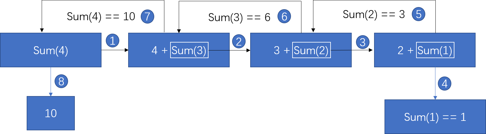
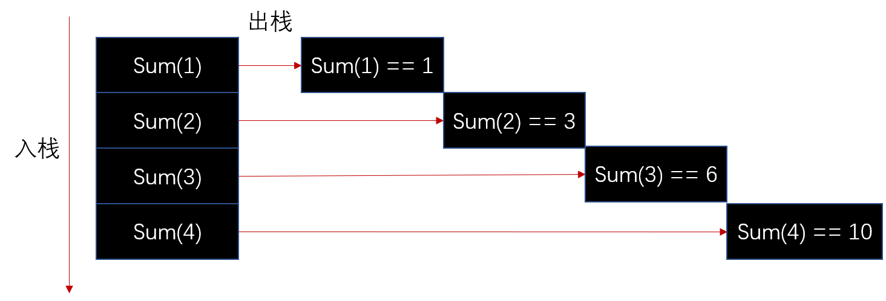

# 递归
递归是一种很常见的算法，许多循环算法可以转变成递归。递归的一般形式是这样的：  

```js
function fn(n){
    if(n === 1){
        return 2;   // 1
    }
    return fn(n - 1) + n;   // 2
}
```

也就是递归一般会有一个判断，这是递归算法的出口（1 处）；还有一个返回这个函数的执行结果（2 处）；这两点是实现递归的关键。如果没有出口，递归就会变成死循环，而如果没有函数自身内部调用就无法构成递归。  

很多人刚开始学递归的时候估计都有这么一种感觉（我就是），看到这样的表达式：`fn(n - 1) + n`，有点懵逼，一个函数怎么能在它自己内部再调用自己呢？思考了之后大概明白了一些（难以言表），确实可以在内部调用，最后可能脑袋里会有一个类似“洋葱”的结构，函数包裹者函数，上面那种递归是最简单的一种形式了，差不多能想明白。  

要理解递归需要先了解递归的运行机制。许多递归算法可以由循环来实现，但是用递归有时会更简洁一些。举个例子，一个非常简单的算法：输入一个正整数，计算出从一到这个数的和，如果使用循环可以这么写：  

```js
function sum(n){
    var s = 0;
    while(n){
        s += n;
        n --;
    }
    return s;
}
```

而如果使用递归呢？就变成了这样：

```js
function sum(n){
    if(n === 1){
        return 1;
    }
    return n + sum(n - 1);
}
```

很明显后者比前者代码量小。想要把递归写出来就需要考虑处递归的出口，在这里出口是 1，因为第一个数总是 1。假如 n = 6，下面是整个函数大概的运行的过程：  

```
sum(6);

6 + sum(5);
6 + 5 + sum(4);
6 + 5 + 4 + sum(3);
6 + 5 + 4 + 3 + sum(2);
6 + 5 + 4 + 3 + 2 + sum(1); 

当 n === 1 时，return 1;
6 + 5 + 4 + 3 + 2 + 1;      // 21
```

## 执行栈
上面的运行过程可能会有疑惑，既然函数被 return 出去了（`return n + sum(n - 1);`），为什么能会继续计算呢？  

因为虽然有 `return` 语句但是返回的是函数执行，还要执行返回的这个函数，因此最外层的 sum 函数并没有执行完，他需要等待里面的函数执行完才算执行完，而里面的函数又会 return 出更里面的函数执行，就这个一层层执行，外层函数总是等待着内层函数执行完毕。于是就变成了这个样子（假设 n 为 4）：  

  

从图中可以看出，要想获得 `sum(4)` 的值就需要先获得 `sum(3)` 的值，想要获得 `sum(3)` 的值就要获得 `sum(2)` 的值，以此类推直至得到 `sum(1)` 的值，这个过程被称为 **递推**；而知道了 `sum(1)` 的值之后，`sum(2)` 的值也就知道了，以此类推，`sum(4)` 的值也就求得了，这个过程被称为 **回溯**。  

因此，递归包括`递推`和`回溯`两部分。`递推`时将函数压入栈中，而`回溯`是将栈里的元素弹出。一个函数在执行时，会把这个函数送进执行栈中，当函数执行完毕后，会把该函数从栈内移出。  

  

因为栈是“先进后出”，因此 `sum(4)` 最先入栈，最后才出来。  

执行栈中的函数们并不是“线式”的，而是嵌套式的，比如下面的函数：  

```js
function a(){
    b();
    c();
    d();
}
function b(){
    e();
}
function e(){
    f();
}
a();
c();
```

当函数 `a` 执行时，入栈（只有函数执行时才会入栈）元素是这样的：

```
f
e
b
a
```

执行函数 a，入栈，a 中有函数 b 要执行，将 b 压入 a 函数的栈里（因为在 a 函数内部执行），b 函数里面有函数 e 执行，将 e 压入栈中，e 里面又有 f 执行，因此也将 f 压入栈中，当“b、e、f” 这些函数执行完毕后（应该说是 b 函数执行完，出栈），继续执行 a 函数下面的语句，执行 c 函数，将 c 函数入栈，执行 c 函数，函数执行完毕后，继续执行 d 函数，d 函数执行完毕后，a 函数也就执行完毕了，于是将 a 函数出栈。然后执行 a 函数后面的语句，将 c 函数入栈......  

## 实战
递归在算法中应用十分广泛，相较于循环迭代，递归显得更加优雅直观，代码易读性好一些。但是使用递归并不一定比迭代运行速度快，因此递归需要先递推后回溯，而迭代没有那么多的过程。  

通过上面简单的例子可以看出，使用递归可以让我们使用更少的代码解决问题。  

比如一个常见的例子，将一个数组扁平化，出入一个 N 维数组，将这个数组变成一维数组。具体算法如下：  

```js
function flat(array) {
    var result = [];
    array.forEach(item => {
        if(Array.isArray(item)){
            var res = flat(item);
            result = result.concat(res);
        }else{
            result.push(item);
        }
    });
    return result;
}
```
