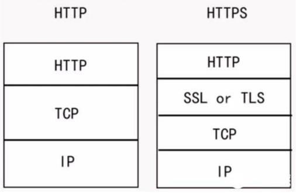
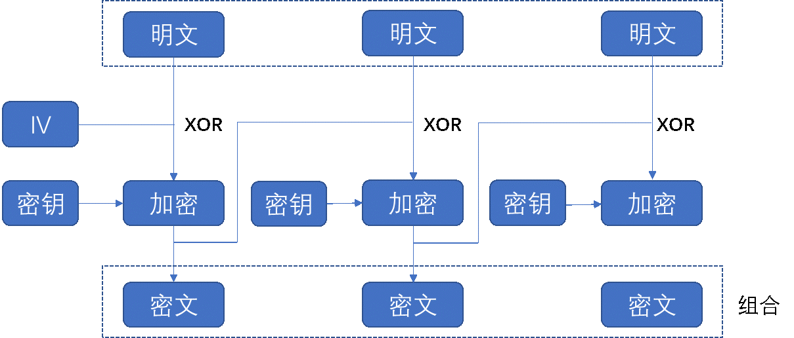
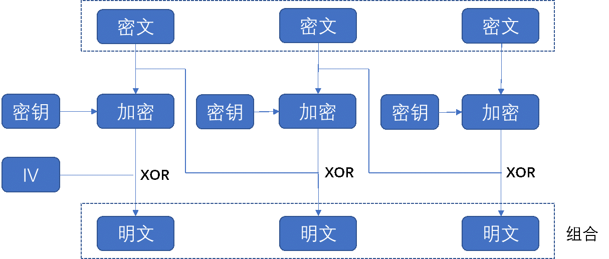
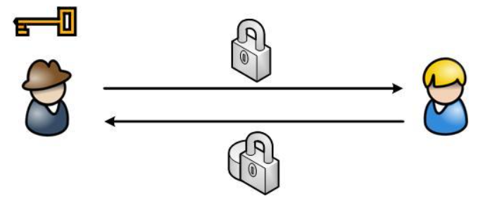
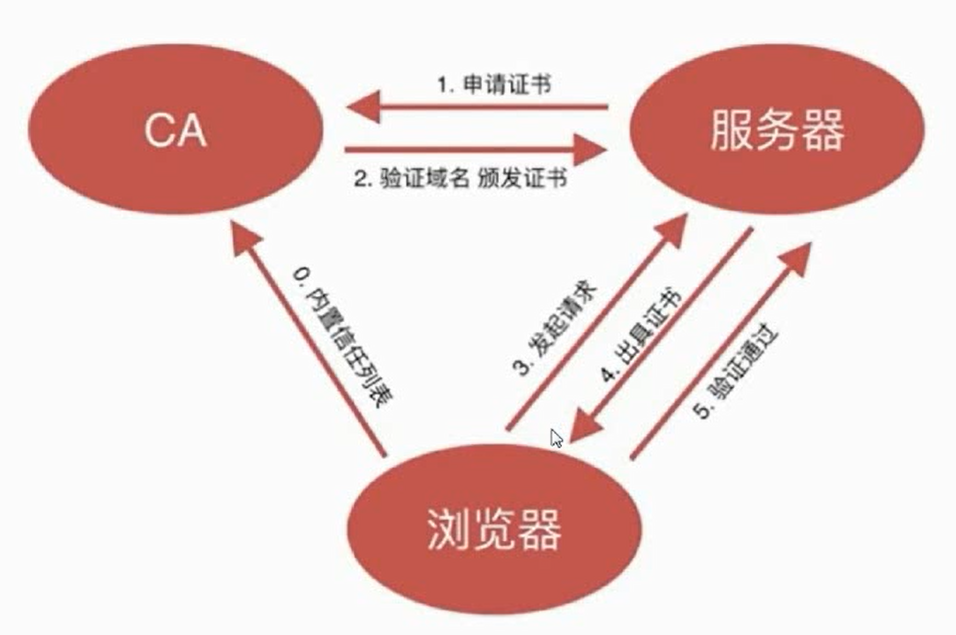

# HTTPS 基本原理

随着 Internet与多媒体技术的飞速发展, Web技术已经发生了翻天覆地的变化，不再是过去的静态网页或者纯展示型的文档结构，网页变得丰富多彩，各种富媒体内容可以由网页承载，网页如今也被称为Web APP。而Web技术核心的组成部分是 HTTP（Hyper Text Transfer Protocol，超文本传输协议），HTTP 由客户端和服务器组成，用于在 Web 上传输超媒体文件的底层协议 ，最典型场景的是在浏览器和服务器之间传递数据，以供人们浏览。  

HTTP在设计之初并没有考虑安全问题，它的设计目的是数据传输和共享。HTTP 安全问题主要有以下三点：  

（1）数据没有加密。HTTP 本身不会加密数据，这就会导致一个问题，如果传输的数据被攻击者截获，因为数据是明文，用户的隐私就完全暴露了。在网络传输过程中，路由决策将决定 HTTP 数据会通过哪些节点设备，而这些节点设备可以很轻松的获取明文数据。  

（2）数据容易被窃听和篡改。数据在传输过程中，会经过许多节点（这可能有很多设备，比如路由器、集线器、代理服务器等），这些节点都可以窃听和篡改原始数据。由于没有机制可以确保数据的完整性，客户端和服务器端只能无条件的信任收到的数据。篡改数据也叫做中间人攻击。比如有时候我们浏览器网页，有的网页会有很多广告，这些广告遮挡了页面内容，数据很可能在传输过程中被篡改，ISP 插入了广告。  

（3）无法验证身份。HTTP 协议本身是无状态的，即使是同一个人通过 HTTP 协议发送多次请求，服务器端也无法判断这几次请求是不是同一个人，虽然现在广泛使用 cookie + session 技术实现了状态管理，但这并不算属于 HTTP 协议的内容，它们是 HTTP 的扩展，不同的 Web 开发者可能实现方式也不尽相同。而如果没有身份验证会出现很多安全问题，身份验证机制设计的不好很有可能出现身份伪造的情况。

## 安全的 HTTP 通道

HTTP 之所以容易被窃听和篡改，主要是因为 HTTP 在传输数据时不加密，要想解决这一问题，最直接的办法就是对数据加密，加密之后再传输。在 HTTP 协议层之下加入一个 TLS 层（Transport  Layer Security，传输层安全协议），用于数据加密，这就构成了 HTTPS。即：HTTPS = HTTP + TLS。

  

上图中，SSL 协议与 TLS 协议可以认为是一样的，TLS 协议是 SSL 协议的升级版。TLS 协议是一个独立的协议，它不仅可以对接 HTTP，还可以对接别的应用层协议，比如 FTP、POP、Telnet 等，这些协议也都是明文传输，本质上是不安全的。  

## 加密算法

TLS 协议制定了许多加密算法，要了解 HTTPS 的工作原理，就需要先了解一些加密算法。这里主要说一下两种主要的加密算法——对称加密和非对称加密。  

### 对称加密算法

对称加密很好理解，假如服务器要给客户端发数据，发送之前服务器用一个密钥对数据加密，然后把数据发到客户端，但是客户端如何解密呢？服务器就需要把密钥发到客户端，客户端使用密钥进行解密。客户端与服务器的密钥是相同的，或者说两者共享一个密钥，因此称之为对称加密。  

对称加密可以用下面的公式表述： 

```
密文 = E(明文，算法，密钥)
明文 = E(密文，算法，密钥)
```

`AES` 算法是对称加密的标准算法，它的 CBC 加密模式流程如下：

1. 把明文数据分成多个等分的数据块，最后一个数据块可能会小于其他的数据块，这就需要对最后一个数据块进行填充，让它等于分组长度；
2. 首先处理第一个数据块生成一个随机的初始化向量 IV（Initialization Vector），初始化向量和第一个数据块进行 XOR（异或）运算，运算的结果经过加密得到第一个密文分组。一般情况下，初始化向量和密文是同时传输给解密者的，而且初始化向量是不加密的；
3. 接着处理后续的数据块，第 n 个数据块会和前n-1密文分组进行 XOR 运算，运算的结果再进行加密得到第 n 个密文分组。对于第一个数据块来说，它的前一个密文分组就是初始化向量；
4. 最后把每个密文组合在一起就是完整的密文了。流程如图2所示。

  

对称假面算法运行速度还是很快的，核心就是二进制的 XOR 异或逻辑运算，这是计算机很擅长的。  

对称加密的明文与密钥一次异或操作可以得到密文，因为攻击者不知道密钥，因此也就很难推算出明文。数据传送到客户端后，客户端使用密钥对密文进行异或就得到了明文。比如“666”是明文，“333”是密文，666⊕333⊕333 就会得到明文“666”。解密过程如下图。  

  

对称加密并不太安全，因为客户端与服务器共享密钥，密钥需要传递，这就有可能在传输过程中让攻击者截获密钥，有了密钥，密文也就容易解开。但对称加密进行XOR 操作，处理速度很快。  

### 非对称加密算法

非对称加密算法又叫做公开密钥加密算法。在对称加密算法中，密钥是共享的，这可能导致密钥泄露。非对称加密算法也有密钥，不过密钥是一对，一个是公钥，公钥任何人都可以持有，也不怕泄露；另一个是私钥，一般由密钥对的生成方持有（比如服务器），私钥应避免泄露。`RSA` 算法是非对称加密算法的标准算法，它生成密钥对的过程如下：

1. 选取两个很大的质数 `p` 和 `q`；
2. 求出这两个数的乘积 `n`；
3. 随机选取一个公开指数e，这个数应小于(p-1)(q-1)，并且e对应的值要与(p-1)(q-1)的值互质（公约数只有1的两个整数）；
4. `e` 和 `n` 组合起来相当于公钥，n的长度是密钥对的长度；
5. 找到一个整数d，可以使`e*d`除以 n 的余数是 1，即 `e*d % n = 1`。
6. 一旦计算出私钥，p 和 q 这两个数就可以丢弃，这样更安全。如果不丢弃且和d一同保存在私钥文件中，则运算的时候效率更高。e 和 d 之间存在互逆的关系。  

RSA算法的加密公式：

$$ C = M^e \ (mod \ n) $$

公式中 `M` 就是明文，`mod` 表示模运算，运算之后最终得到密文 C。

RSA解密公式： 

$$ M = C^d(mod \ n) $$

加密和解密运算可以互逆，这依赖于算法和密钥对，过程如下：  


$C^d$ 的过程相当于  

$$ (M^e)^d $$  

而 $(e*d) \ mod \ n$ 等于 `1`。  

$C^d \ (mod \ n)$ 最终能反解出 `M`。

公钥持有人有 e 和 n，而要计算出私钥 d，需要知道 p 和 q，想通过一个巨大的数字 n 获取 p 和 q 是一个因式分解问题，暴力破解很难。攻击者假如想通过密文和公钥破解私钥，就要求解决离散对数问题，更是难上加难。  

下面以一个例子说明公开密钥算法的工作流程。  

假如小红想向小明送东西，但是他们怕被人看到，于是小明买了一把锁（相当于公钥）和一把钥匙（相当于私钥），送东西之前，小明会把开着的锁发给小红，这时小红拥有小明的锁。小红要给小明送东西，就会用小明的锁把东西锁起来（加密），物品发到小明那里时，小明使用自己的钥匙开自己的锁（解密），这就是非对称加密的工作流程。在非对称加密算法中，使用公钥加密，私钥解密的方式处理数据。发送密文的一方使用对方的公开密钥进行加密处理，对方收到加密的信息后，再使用自己的私钥进行解密。

  

### CA 证书

上面介绍了对称加密和非对称加密的流程。非对称加密算法相比于对称加密算法比较复杂，运算速度比较慢，但要比对称加密算法可靠。但公开密钥算法也有一个严重的问题：公钥是公开的，在传输过程中可能被第三方篡改。攻击者截获公钥后换成自己的公钥，然后发给对方。对方显然不清楚这个公钥是不是真的，他“上锁”之后，又被攻击者截获，攻击者就可以使用自己的私钥解密出数据。  

上述问题的本质原因是没有办法鉴别对方发来的公钥的“真伪”。为了解决这个问题，可以使用由数字证书认证机构和其他相关机关颁发的公开密钥证书。
数字证书认证机构（CA，Certificate Authority）处于客户端和服务器双方都信任的第三方机构的立场上。这种机构是权威的，就像派出所可以办理身份证一样，证件很难伪造。

CA也是使用公开密钥算法，CA的主要业务就是颁发证书。首先，服务器的运营人员向CA提出公开密钥的申请，数字证书认证机构在判明提出申请者的身份之后，回对已申请的公开密钥做数字签名，然后分配这个已签名的公开密钥，并将这个公开密钥放入公钥证书后绑定在一起。  

然后服务器将这份由数字证书机构颁发的公钥证书（或叫数字证书）发送给客户端，这是为了进行公开密钥加密方式通信。  

接收到证书的客户端可以使用CA的公开密钥（CA的公开密钥已经事先植入到浏览器里了。CA的密钥对是私钥加密，公钥解密），对证书上的数字签名进行验证，如果验证通过，客户端就会认为服务器端的公开密钥是真实有效和值得信任的。大致过程如图5所示。

  

考虑到非对称加密要比对称加密复杂，效率低下，HTTPS 也可以采用混合加密方式，首先使用公开密钥方式安全地交换在稍后的对称加密中要使用的密钥，然后在确保交换的密钥是安全的前提下，使用对称加密方式进行通信。

HTTPS 在保护用户隐私、防止流量劫持方面发挥着关键的作用，但是与此同时，HTTPS 也带了一些缺陷，比如：  

- 要使用HTTPS，就需要申请证书，而证书一般都是收费的；
- 对于比较大的网站，要从 HTTP 升级到 HTTPS，更新维护成本比较高；
- 因为 HTTPS 相比于 HTTP，多了一层 TLS 层，在通信时还需要对数据进行加密和解密，这就会导致用户在访问 HTTPS 的站点时访问速度降低，加密算法还会消耗 CPU 计算，这可能要增加机器。


#### 参考

[1] 虞卫东. 深入浅出HTTPS：从原理到实战，电子工业出版社，2018.  
[2] 上野宣、于均良. 图解HTTP，人民邮电出版社, 2014.
