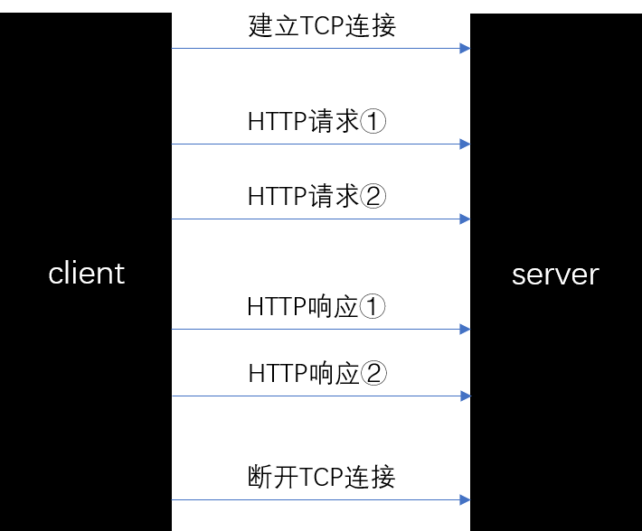
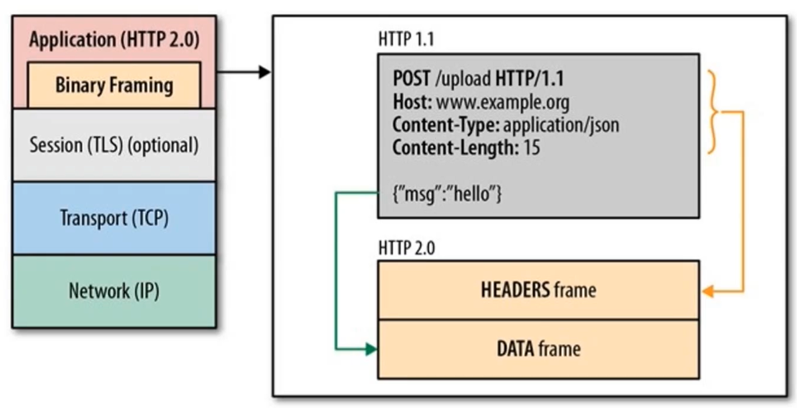
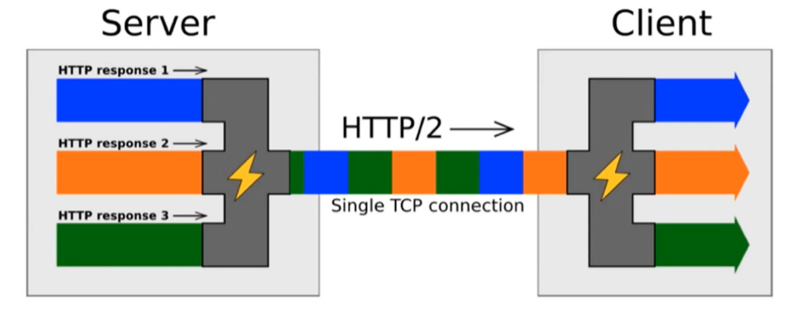
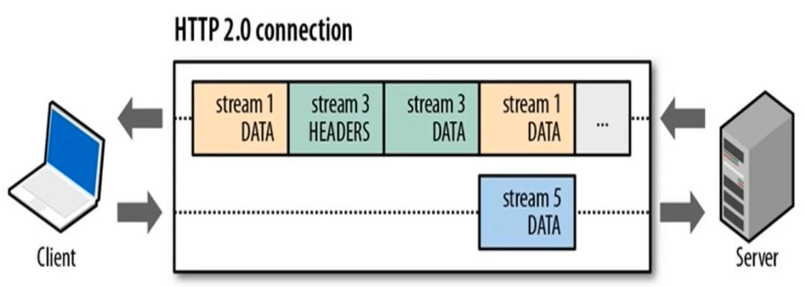

# HTTP

## 1. HTTP 的特点

1. **简单**，HTTP 大体上还是被设计得简单易读。HTTP 报文能够被人读懂，还允许简单测试，降低了门槛，对新人很友好。
2. **可扩展**，只要服务端和客户端就新 `headers` 达成语义一致，新功能就可以被轻松加入进来，可见 HTTP 的灵活性很好；  
3. **无状态**，在同一个连接中，两个执行成功的请求之间是没有关系的。而使用 HTTP的头部扩展，`HTTP Cookies` 能创建有状态的会话，就可以解决这个问题；  
4. 通过请求和响应的交换达成通信。请求由客户端发出，而服务器端回复响应；  
5. 可靠传输，底层依托 TCP 协议；
6. **无连接**，HTTP 依赖于面向连接的`TCP`进行消息传递，但连接并不是必须的。HTTP/1.0 默认为每一对 HTTP 请求/响应都打开一个单独的 TCP 连接，请求/响应 完成之后就会断开连接。

## 2. HTTP 报文组成
HTTP 报文大致可以分为 `报文首部` 和 `报文主体` 两部分，这两部分用空行划分（`CR+LF`，`CR` 表示回车符，十六进制是 `0x0d`；`LF` 表示换行符，十六进制是 `0x0a`）  

- 报文首部：服务器端或客户端需处理的请求或响应的内容及属性；
- 报文主体：应被发送的数据。  

```
报文首部
空行（CR+LF）
报文主体
```

客户端的 HTTP 报文叫做请求报文，服务器端的报文 HTTP 报文叫做响应报文。HTTP 请求报文包括：  

- 请求行；
- 请求首部字段；
- 通用首部字段；
- 实体首部字段；
- 其他（可能包含 HTTP 的 RFC 里未定义的首部，如 `Cookie` 等）；

HTTP 响应报文包括：  

- 响应行；
- 响应首部字段；
- 通用首部字段；
- 实体首部字段；
- 其他（可能包含 HTTP 的 RFC 里未定义的首部，如 `Cookie` 等）；  

### 请求行
它包括：
- 请求方法；
- 请求 URI；
- HTTP 版本。  

例如：  

```
GET /index.html HTTP/1.1
```

### 响应行
它包括：
- HTTP 版本；
- 状态码；
- 状态描述（原因短语）；

例如：  

```
HTTP/1.1 200 OK
```

## 3. HTTP 中的请求方法

|方法|说明|支持的 HTTP 协议版本|
|:---|:---|:---|
`GET`|获取资源|1.0、1.1|
`POST`|传输资源|1.0、1.1|
`PUT`|更新资源|1.0、1.1|
`DELETE`|删除资源|1.0、1.1|
`HEAD`|获取报文首部|1.0、1.1|
`OPTIONS`|询问支持的方法|1.1|  

### POST 与 PUT 的区别

`PUT` 与 `POST` 方法的区别在于，`PUT`方法是 **幂等** 的：调用一次与连续调用多次是等价的（即没有副作用），而连续调用多次`POST`方法可能会有副作用，比如将一个订单重复提交多次。`PUT` 称为更新资源（比如：昵称，它只有一份），而 `POST` 是提交（比如任意的上传资源）。当然，这只是规范里的，具体实现还是看自家的服务器。  

但是，鉴于 HTTP/1.1 的 `PUT` 方法自身不带验证机制，存在安全风险，因此一般的网站不使用该方法。若配合 web 应用程序的验证机制，或架构设计采用 REST 标准的 web 网站，还是能弥补这一安全性问题的。

### GET 与 HEAD 的区别

`HEAD` 方法和 `GET` 方法一样，只是不返回报文主体部分。`HEAD` 方法主要用于确认 `URI` 的有效性及资源更新的日期等。

## 4. GET 请求与 POST 请求的区别？  

主要区别有这几个方面：  

1. 语义不同，GET 是获取数据，POST 是提交数据；
2. HTTP 规定 GET 比 POST 安全，因为 GET 只做读取，不会改变服务器中的数据。但这只是规范，并不保证请求方法的实现也是安全的；
3. GET 请求会把附加参数带在 URL 上，而 POST 请求会把提交的数据放在报文内（request body）。在浏览器中，URL 长度会被限制，所以 GET 请求能传递的数据有限，但 HTTP 其实并没有对其作限制，都是浏览器在控制；  
4. HTTP 规定 GET 请求是幂等的，而 POST 请求不是。所谓幂等是指多次请求返回相同的结果。实际应用中，并不会这么严格，当 GET 获取动态数据时，每次的结果可能会有所不同；  
5. GET 请求在浏览器回退时是无害的，而 POST 会再次提交请求；
6. GET 请求会被浏览器主动缓存，而 POST 不会，除非手动设置；
7. GET 请求参数会被完整保留在浏览器历史记录里，而 POST 中的参数不会被保留；
8. 对于参数的数据类型，GET 只接受 ASCII 字符，而 POST 没有限制；  

## 5. HTTP 中的常见状态码

共有 5 类状态码：  

+ `1XX`，信息性状态码（Informational）。表示接收的请求正在处理；  
+ `2XX`，成功状态码（Success）。表示请求正常处理完毕；
+ `3XX`，重定向状态码（Redirection）。表示需要进行附加操作以完成请求；
+ `4XX`，客户端错误状态码（Client Error）。表示服务器无法处理请求；
+ `5XX`，服务器端错误状态码（Server Error）。表示服务器处理请求出错。  

常见的一些状态码与描述：  

- `200 OK`，表示从客户端发来的请求在服务器端被正常处理了；
- `204 No Content`，请求处理成功，但是返回的响应报文中不包含实体的主体部分。默认情况下 `204` 响应是可缓存的。一个 `ETag` 标头包含在此类响应中；
- `206 Partial Content`，客户端进行范围请求，并且成功执行了这部分 `GET` 请求。响应报文中包含 `Content-Range` 指定范围的实体内容；
- `301 Moved Permanently`，永久重定向。表示请求的资源已经被分配了新的 URL，请求的资源已经被移动到了由 `Location` 头部指定的 `URL` 上；
- `302 Found`，临时重定向。所请求的页面已经临时转移至新的 URL。
- `304 Not Modified`，客户端有缓存的文档并发出了一个条件性的请求，服务器告诉客户端，原来缓存的文档还可以继续使用，这时就会返回 `304` 状态码，`304` 与重定向无关。
- `400 Bad Request`，客户端请求有语法错误，不能被服务器所理解；
- `401 Unauthorized`，请求未经授权，这个状态码必须和 `WWW-Authenticate` 首部一起发送，其中包含有如何进行验证的信息（比如 `token`）`401` 表明验证信息不通过；
- `403 Forbidden`，对请求页面的访问被禁止；
- `404 Not Fount`，请求资源不存在；
- `500 Internal Server Error`，表示服务器端错误的响应状态码，意味着所请求的服务器遇到意外的情况并阻止其执行请求；
- `503 Service Unavailable`，它表示服务器尚未处于可以接受请求的状态。通常造成这种情况的原因是由于服务器停机维护或者已超载（例如某个用户使用爬虫程序导致服务器请求量过大，服务器不再接受该用户的请求）。  

更多 HTTP 状态码可以参考 MDN 上的文档：[HTTP response status codes](https://developer.mozilla.org/zh-CN/docs/Web/HTTP/Status)

## 6. HTTP 持久连接

HTTP/1.0 默认为每一对 HTTP 请求/响应都打开一个单独的 TCP 连接，请求/响应 处理完后就会断开连接。当需要连续发起多个请求时，这种模式比多个请求共享同一个 TCP 链接更低效。  

为了减轻这些缺陷，`HTTP/1.1` 引入了持久连接的概念：底层的 TCP 连接可以通过`Connection` 头部来被部分控制。  

持久连接的特点是：只要任意一端没有明确的提出断开连接，则保持 TCP 连接状态。

HTTP/1.1 中，所有的连接都是持久连接。即：
```
Connection: keep-alive
```

因此默认情况下，客户端会在持久连接上发送请求，如果服务器想要明确断开连接可以将 `Connection` 设置成 `close`。  

```
Connection: close
```

> HTTP 持久连接的好处在于 TCP 连接的重复建立和断开所造成的额外开销，减轻了服务器的负载。另外，减少开销的那部分时间，使 HTTP 请求和响应能更早的结束，这样 Web 页面的显示速度也就相应提高了。

## 7. HTTP 管线化

从前发送请求后需要等待并收到相应才能发送下一条请求。而管线化技术出现后，可以不用等待相应也可以直接发送下一条请求，管线化技术让请求可以更快的结束。  



HTTP 管线化有以下几个特点：  

- 管线化机制通过 **持久连接** 完成，仅 HTTP/1.1 支持此技术；
- 只有 GET 和 HEAD 请求可以进行管线化，而 POST 则有所限制；
- 初次创建连接时不应启动管线化机制，因为对方（服务器）不一定支持 HTTP/1.1 版本的协议；
- 管线化不会影响响应到来的顺序；
- HTTP/1.1 要求服务器端支持管线化，但并不要求服务器端也对响应进行管线化处理，只是要求对于管线化的请求不失败即可；
- 开启管线化很可能并不会带来大幅度的性能提升，而且很多服务器端和代理程序对管线化的支持并不好，因此现在浏览器如 Chrome、Firefox 都默认并未开启管线化支持。  

## 8. HTTP/2.0 中的内容

在 HTTP/2.0 之前，HTTP 标准的瓶颈：  

- 单路连接，请求低效（一个连接上只可发送一次请求）；
- 请求只能从客户端开始，客户端不可以接收除响应以外的命令；
- 请求/响应首部未经压缩就发送，首部信息越多延迟就越大；
- 发送冗长的首部，每次相互发送相同的首部造成的浪费较多；
- 可任意选择压缩格式，非强制压缩发送。

然后谷歌在 2010 年推出了 SPDY，它可以说是 HTTP/2.0 的前身。SPDY 的优化：  

- 多路复用，请求优化。单一的 TCP 连接可以无限制处理多个 HTTP 请求；  
- 支持服务器推送技术。就像 webSocket 协议一样，服务器可以直接发送数据，不需要等待客户端的请求；  
- 压缩 HTTP 首部。这样可以减少数据包的字节数；
- 强制使用 SSL 传输协议。使传输过程更加安全；
- 赋予请求优先级。处理多个请求时，可以给请求逐个分配优先级顺序，这样就可以让重要的资源先被处理。  

而 HTTP/2.0 比 SPDY 更“先进”，它不仅包含 SPDY 中的优化项，而且自身还有以下特点：  

- 二进制分帧（Binary Framing）。可以说是 HTTP/2.0 的核心技术。HTTP/2.0 通信在一个 TCP 连接上完成，这个连接可以承载任意数量的双向数据流，相应的每个数据量都以消息的方式发送，而消息由一个或多个帧组成，这些帧可以乱序的发送，然后另一端再根据每个帧首部的流标识符重新组装。  

  



- 并行双向字节流的请求和响应。使请求之间互不影响，响应之间互不干扰。只需一个 TCP 连接即可并行发送多个请求和响应。这样就消除了不必要的延迟，减少页面的加载时间；  



服务器或客户端可以一边发送着数据流，还可以一边接收数据量。

## 9. HTTPS 工作原理


## 10. 代理、网关、隧道


## 什么是 CSRF 攻击？如何防御 CSRF 攻击？  

CSRF（Cross Site Request Forgery）即跨站请求伪造。攻击者伪装成正常用户，对服务器发起请求，让服务器执行某些操作。例如，用户正常登录某个网站，然后在未退出的情况下访问了攻击者事先准备好的页面，此时攻击者就可能获取到保存在 Cookie 中的登录凭据或登录信息，然后攻击者就能伪装成该用户，与服务器开始通信。CSRF 的防御手段：  

1. 让用户与网站进行交互才能完成请求，例如在表单中添加验证码。  
2. 检查请求是否是来自合法的源，例如上一页的域名是否与当前相同（`Referer` 头）。
3. 在每个请求中添加一个 token 参数，这是一个随机数，可以在进入页面时生成，然后保存在 `Session` 中，服务器在接收到 Token 参数时进行校验，只有当校验成功时才执行后面的操作。  


